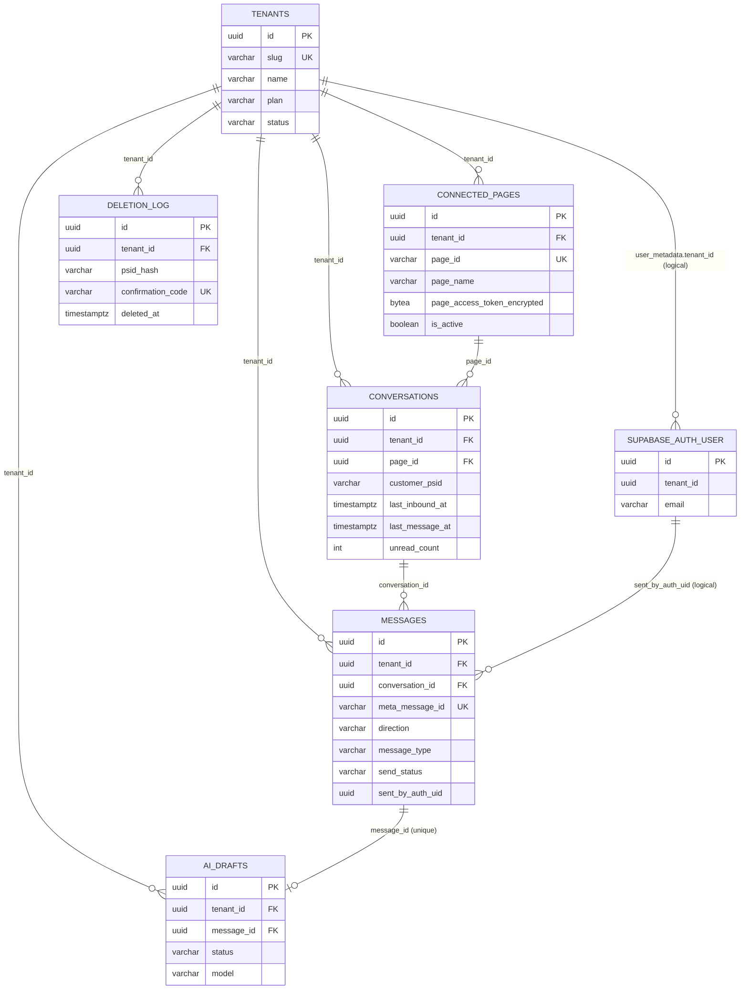

# Phase 1: Data Model

**Feature**: MVP for Meta App Review Submission
**Branch**: `001-mvp-app-review`
**Date**: 2026-04-20
**Updated**: 2026-04-30 (multi-tenant SaaS 化を最初から組み込み: tenants テーブル + 全データテーブルに tenant_id + RLS + Page Access Token 暗号化カラム)
**Storage**: Supabase Postgres（東京リージョン、無料プラン）
**ORM**: Drizzle ORM
**Authentication**: Supabase Auth（DB にユーザー／セッション情報を持たない）
**Tenancy**: マルチテナント前提（`tenants` テーブル + 全データテーブルに `tenant_id` + RLS で防衛）

本アプリは将来の SaaS 販売を見据え、**最初からマルチテナントアーキテクチャ**で構築する。MVP 期間中は tenant 1 件（Malbek）を seed で事前作成し、Meta レビュワーは既存テナントにログインする。セルフサインアップ画面と Stripe 課金統合は Phase 2 で追加する（DB スキーマと middleware は今から対応）。

以下 5 エンティティ + 1 マスタ（tenants）= 計 6 テーブル。

---

## Entity: `tenants`

SaaS のテナント（契約事業者）。MVP では 1 行（Malbek）。Phase 2 でセルフサインアップが各 INSERT を発行する。

| Column | Type | Constraints | Notes |
|--------|------|-------------|-------|
| `id` | `uuid` | PK | `gen_random_uuid()` |
| `name` | `varchar(255)` | NOT NULL | 表示名（例: `Malbek`）|
| `slug` | `varchar(64)` | UNIQUE NOT NULL | URL / 課金識別子用（例: `malbek`、`/^[a-z0-9-]+$/` 制約）|
| `plan` | `varchar(32)` | NOT NULL DEFAULT `'free'` | `'free' | 'pro' | 'enterprise'`（MVP は `'free'` 固定、Phase 2 で Stripe 連携）|
| `stripe_customer_id` | `varchar(64)` | NULL | Phase 2 で利用、MVP では NULL |
| `status` | `varchar(20)` | NOT NULL DEFAULT `'active'` | `'active' | 'suspended' | 'deleted'`、suspended でログイン拒否 |
| `created_at` | `timestamptz` | NOT NULL DEFAULT `now()` | |
| `updated_at` | `timestamptz` | NOT NULL DEFAULT `now()` | |

**Indexes**:
- UNIQUE (`slug`)
- INDEX (`status`)

**RLS**: **OFF**（テナント自身を識別するメタテーブル。アプリは service role で限定的に操作）。アプリの一般リクエストでは触らず、サインアップフロー（Phase 2）と admin 操作のみが触る。

---

## Entity: `connected_pages`

連携済みの Facebook ページ。**1 tenant 多 connected_pages**（将来的に 1 テナントで複数ページ管理）。MVP では 1 tenant × 1 page。

| Column | Type | Constraints | Notes |
|--------|------|-------------|-------|
| `id` | `uuid` | PK | `gen_random_uuid()` |
| `tenant_id` | `uuid` | FK → `tenants.id` NOT NULL | RLS フィルタ用 |
| `page_id` | `varchar(64)` | UNIQUE NOT NULL | Facebook ページ ID（テナント横断で UNIQUE：1 つの FB ページは 1 テナントにのみ紐づく）|
| `page_name` | `varchar(255)` | NOT NULL | 表示名 |
| `page_access_token_encrypted` | `bytea` | NOT NULL | **AES-256-GCM 暗号化された長期 Page Access Token**。マスター鍵は SSM `/fumireply/master-encryption-key`。形式：`iv (12B) || auth_tag (16B) || ciphertext` |
| `webhook_verify_token_ssm_key` | `varchar(255)` | NOT NULL | Webhook 購読時の verify_token の SSM キー。**全テナント共通の verify_token を使う**（Meta App は 1 つのため）。MVP の seed 値は `/fumireply/review/meta/webhook-verify-token` |
| `connected_at` | `timestamptz` | NOT NULL DEFAULT `now()` | |
| `is_active` | `boolean` | NOT NULL DEFAULT `true` | 停止時に `false` |

**Indexes**:
- UNIQUE (`page_id`)
- INDEX (`tenant_id`)

**RLS**: ON。ポリシー：`tenant_id = current_setting('app.tenant_id')::uuid`。
- 例外：webhook-lambda は `page_id` から `tenant_id` を解決する**前**に検索が必要なため、secret key（`sb_secret_...`、`service_role` 権限で BYPASSRLS）で接続して RLS をバイパスする。検索後は解決した `tenant_id` を `app.tenant_id` にセットして以降の操作に進む。

**設計意図**:
- **暗号化カラム化の理由**：旧方針（SSM パス `/fumireply/<tenant>/page-access-token`）では tenant 増加時に SSM 操作が必要で、SaaS のセルフサインアップに耐えない。アプリが暗号化して DB に書き込む方式なら、tenant 数に依存せずスケールする。
- マスター鍵 1 本ローテーションで全テナントのトークンを再暗号化する運用は Phase 2 で整備（KMS 移行案も含む）。
- `webhook_verify_token` は全テナント共通の Meta App 設定なので tenant 別に持つ意味がなく SSM のまま。

---

## Entity: `conversations`

特定の顧客（Messenger ユーザー）と連携ページとの会話スレッド。

| Column | Type | Constraints | Notes |
|--------|------|-------------|-------|
| `id` | `uuid` | PK | |
| `tenant_id` | `uuid` | FK → `tenants.id` NOT NULL | RLS フィルタ用 |
| `page_id` | `uuid` | FK → `connected_pages.id` NOT NULL | |
| `customer_psid` | `varchar(64)` | NOT NULL | Meta Page-Scoped ID |
| `customer_name` | `varchar(255)` | NULL | Phase 2 で取得 |
| `last_inbound_at` | `timestamptz` | NULL | 24 時間窓カウントダウン用 |
| `last_message_at` | `timestamptz` | NULL | スレッド並び替え用 |
| `unread_count` | `integer` | NOT NULL DEFAULT `0` | 受信トレイバッジ用 |
| `created_at` | `timestamptz` | NOT NULL DEFAULT `now()` | |

**Indexes**:
- UNIQUE (`page_id`, `customer_psid`)
- INDEX (`tenant_id`, `last_message_at` DESC) — 受信一覧の並び替え用
- INDEX (`tenant_id`)

**RLS**: ON。ポリシー：`tenant_id = current_setting('app.tenant_id')::uuid`。

---

## Entity: `messages`

個別のメッセージ（受信・送信の両方）。

| Column | Type | Constraints | Notes |
|--------|------|-------------|-------|
| `id` | `uuid` | PK | |
| `tenant_id` | `uuid` | FK → `tenants.id` NOT NULL | RLS フィルタ用 |
| `conversation_id` | `uuid` | FK → `conversations.id` NOT NULL | |
| `direction` | `varchar(10)` | NOT NULL, CHECK (`direction IN ('inbound','outbound')`) | |
| `meta_message_id` | `varchar(128)` | UNIQUE NULL | Meta の `mid`。冪等性キー |
| `body` | `text` | NOT NULL | 空文字も許容 |
| `message_type` | `varchar(20)` | NOT NULL DEFAULT `'text'` | `text` / `sticker` / `image` / `other` |
| `timestamp` | `timestamptz` | NOT NULL | Meta の `timestamp` を採用。送信時は `now()` |
| `send_status` | `varchar(20)` | NULL, CHECK (`send_status IN ('sent','failed','pending')` OR NULL) | inbound は NULL、outbound は必須 |
| `send_error` | `text` | NULL | 送信失敗時の理由 |
| `sent_by_auth_uid` | `uuid` | NULL | outbound のみ。Supabase Auth の `auth.users.id`（UUID）|
| `created_at` | `timestamptz` | NOT NULL DEFAULT `now()` | |

**Indexes**:
- UNIQUE (`meta_message_id`) where `meta_message_id IS NOT NULL`
- INDEX (`tenant_id`, `conversation_id`, `timestamp` ASC) — スレッド表示
- INDEX (`tenant_id`)

**RLS**: ON。ポリシー：`tenant_id = current_setting('app.tenant_id')::uuid`。

**設計意図**:
- `meta_message_id` の UNIQUE はテナント横断（Meta の mid はグローバル一意のため）。
- `sent_by_auth_uid` は Supabase Auth の `id` 属性。アプリ側で「ユーザーが自テナントに所属するか」のチェックは middleware で済ませているため、ここでは tenant_id へのリンクのみ。

---

## Entity: `ai_drafts`

inbound メッセージに対する AI 返信下書き。

| Column | Type | Constraints | Notes |
|--------|------|-------------|-------|
| `id` | `uuid` | PK | |
| `tenant_id` | `uuid` | FK → `tenants.id` NOT NULL | RLS フィルタ用 |
| `message_id` | `uuid` | FK → `messages.id` NOT NULL UNIQUE | |
| `status` | `varchar(20)` | NOT NULL, CHECK (`status IN ('pending','ready','failed')`) | |
| `body` | `text` | NULL | |
| `model` | `varchar(64)` | NULL | |
| `error` | `text` | NULL | |
| `prompt_tokens` | `integer` | NULL | |
| `completion_tokens` | `integer` | NULL | |
| `latency_ms` | `integer` | NULL | |
| `created_at` | `timestamptz` | NOT NULL DEFAULT `now()` | |
| `updated_at` | `timestamptz` | NOT NULL DEFAULT `now()` | |

**Indexes**:
- UNIQUE (`message_id`)
- INDEX (`tenant_id`)

**RLS**: ON。ポリシー：`tenant_id = current_setting('app.tenant_id')::uuid`。

---

## Entity: `deletion_log`

Meta のデータ削除コールバックに対する削除実行の監査ログ。テナント単位で保持（漏洩時の影響範囲を限定）。

| Column | Type | Constraints | Notes |
|--------|------|-------------|-------|
| `id` | `uuid` | PK | |
| `tenant_id` | `uuid` | FK → `tenants.id` NOT NULL | RLS フィルタ用 |
| `psid_hash` | `varchar(64)` | NOT NULL | SHA-256 ハッシュ |
| `confirmation_code` | `varchar(32)` | UNIQUE NOT NULL | |
| `deleted_at` | `timestamptz` | NOT NULL DEFAULT `now()` | |

**Indexes**:
- UNIQUE (`confirmation_code`) — テナント横断（Meta から code で問い合わせが来るため）
- INDEX (`tenant_id`, `psid_hash`)

**RLS**: ON（テナント所有データの削除証跡）。ただし `GET /data-deletion-status/:code` は認証なしで呼ばれるため、status エンドポイントは service role で `confirmation_code` 直引きする（テナント情報を露出させない）。

---

## RLS（Row Level Security）戦略

**マルチテナント SaaS のため RLS を全テナント所有テーブルで ON にする**（旧方針の「RLS なし」をマルチテナント化に伴い反転）。

### 防衛多層化

| 層 | 役割 |
|---|---|
| **(1) Auth middleware** | JWT から `tenant_id` を抽出し、`status='active'` を確認 |
| **(2) `withTenant` トランザクションヘルパ** | 全 DB アクセスを `db.transaction(async tx => { SET LOCAL app.tenant_id = X; ... })` で包み、`app.tenant_id` を設定 |
| **(3) RLS Policy** | DB レイヤで `tenant_id = current_setting('app.tenant_id')::uuid` を強制。アプリのバグで `WHERE` 句を忘れても他テナントのデータは見えない |
| **(4) Service role 分離** | migration / system 操作（webhook の page_id 検索など）でのみ service role を使う。一般のリクエスト処理は anon role + RLS で動く |

### RLS Policy 定義（`tenants` 以外、共通形）

```sql
ALTER TABLE connected_pages ENABLE ROW LEVEL SECURITY;
ALTER TABLE conversations ENABLE ROW LEVEL SECURITY;
ALTER TABLE messages ENABLE ROW LEVEL SECURITY;
ALTER TABLE ai_drafts ENABLE ROW LEVEL SECURITY;
ALTER TABLE deletion_log ENABLE ROW LEVEL SECURITY;

-- 共通ポリシー（FOR ALL = SELECT/INSERT/UPDATE/DELETE 全て）
CREATE POLICY tenant_isolation ON connected_pages
  FOR ALL
  USING (tenant_id = current_setting('app.tenant_id', true)::uuid)
  WITH CHECK (tenant_id = current_setting('app.tenant_id', true)::uuid);
-- 同様に他 4 テーブルにも作成
```

`current_setting('app.tenant_id', true)` の第二引数 `true` は「未設定なら NULL」の意味（アプリが `SET LOCAL` を忘れても安全側にエラー）。

### Drizzle との統合

```typescript
// app/src/server/db/with-tenant.ts
import { sql } from 'drizzle-orm'
import { db } from './client'

export async function withTenant<T>(
  tenantId: string,
  fn: (tx: typeof db) => Promise<T>,
): Promise<T> {
  return db.transaction(async (tx) => {
    await tx.execute(sql`SET LOCAL app.tenant_id = ${tenantId}::text`)
    return fn(tx)
  })
}
```

全 serverFn / Worker handler は `withTenant(user.tenant_id, async (tx) => { ... })` で DB 操作を包む。

**Supabase Pooler との互換性**: Transaction Pooler（port 6543）で `SET LOCAL` が transaction scope で機能することを確認済み。Session pooler（port 5432）は Lambda 短命接続には向かない。

---

## Authentication（Supabase Auth + tenant claim）

### Supabase Auth ユーザー属性

| 属性 | 用途 |
|------|------|
| `id`（UUID）| Supabase Auth 内部の一意 ID。`messages.sent_by_auth_uid` と突合 |
| `email` | ログイン ID |
| `email_confirmed_at` | 作成時に確認済みとして登録 |
| `user_metadata.tenant_id` | **所属テナントの UUID（`tenants.id`）**。JWT に自動的に含まれる |
| `user_metadata.role` | UI 表示用 `'operator'`（オーナーかどうかの区別等は MVP では使わない）|

### JWT 内の tenant claim

Supabase が発行する JWT の payload 例：
```json
{
  "sub": "<auth-user-uuid>",
  "email": "operator@malbek.co.jp",
  "user_metadata": {
    "tenant_id": "<tenant-uuid>",
    "role": "operator"
  },
  "exp": 1735689600
}
```

`auth-middleware.ts` は `verifyAccessToken(token).user_metadata.tenant_id` で抽出 → `tenants.status='active'` を確認 → `withTenant(tenant_id, ...)` 内で全 DB クエリを実行。

### 初期テナント + ユーザー（MVP）

| tenant.slug | tenant.name | tenant.plan | 初期ユーザー |
|---|---|---|---|
| `malbek` | Malbek | `free` | `operator@malbek.co.jp`、`reviewer@malbek.co.jp`（共に `user_metadata.tenant_id = <malbek tenant uuid>`）|

Supabase Admin API でユーザー作成時に `user_metadata` を指定する。手順は `quickstart.md` を参照。

### Phase 2 のセルフサインアップ動線（参考）

1. `/signup` で email + password + tenant 名 入力
2. アプリが `tenants` INSERT → tenant_id 取得
3. `auth.admin.createUser` で `user_metadata.tenant_id = <new tenant_id>` を付けて作成
4. ログイン → 連携ウィザード（FB ページ連携）
5. Stripe Customer 作成 → `tenants.stripe_customer_id` 更新
6. 初回課金（free → pro 切り替えは Phase 2）

---

## Page Access Token の暗号化

### 暗号化ヘルパ（`app/src/server/services/crypto.ts`）

```typescript
import { createCipheriv, createDecipheriv, randomBytes } from 'node:crypto'

const ALGO = 'aes-256-gcm'

export function encryptToken(plaintext: string, masterKey: Buffer): Buffer {
  const iv = randomBytes(12)
  const cipher = createCipheriv(ALGO, masterKey, iv)
  const enc = Buffer.concat([cipher.update(plaintext, 'utf8'), cipher.final()])
  const tag = cipher.getAuthTag()
  return Buffer.concat([iv, tag, enc])  // 12 + 16 + N bytes
}

export function decryptToken(blob: Buffer, masterKey: Buffer): string {
  const iv = blob.subarray(0, 12)
  const tag = blob.subarray(12, 28)
  const enc = blob.subarray(28)
  const decipher = createDecipheriv(ALGO, masterKey, iv)
  decipher.setAuthTag(tag)
  return Buffer.concat([decipher.update(enc), decipher.final()]).toString('utf8')
}
```

マスター鍵（32 bytes）は SSM `/fumireply/master-encryption-key` から取得しメモリキャッシュ。

### ローテーション戦略（Phase 2 整備）

- 新マスター鍵を生成 → 全 `connected_pages` を旧鍵で decrypt → 新鍵で encrypt して UPDATE → SSM を新鍵に置換。
- ダウンタイムを避けるため `connected_pages.token_key_version smallint` カラム追加で多鍵運用も可能（Phase 2）。

---

## Relationships

```
tenants           (1) ─── (*) connected_pages [tenant_id]
tenants           (1) ─── (*) conversations   [tenant_id]
tenants           (1) ─── (*) messages        [tenant_id]
tenants           (1) ─── (*) ai_drafts       [tenant_id]
tenants           (1) ─── (*) deletion_log    [tenant_id]
connected_pages   (1) ─── (*) conversations   [page_id]
conversations     (1) ─── (*) messages        [conversation_id]
messages          (1) ─── (0..1) ai_drafts    [message_id]
Supabase Auth User    ─── (*) messages        [sent_by_auth_uid, 論理参照]
Supabase Auth User    ─── (1) tenants         [user_metadata.tenant_id, 論理参照]
```

### Mermaid ER Diagram



外部キー削除ポリシー：
- `connected_pages.tenant_id` → `tenants.id`：ON DELETE RESTRICT（tenant 削除は専用フローで CASCADE 実装）
- `conversations.page_id` → `connected_pages.id`：ON DELETE RESTRICT
- `conversations.tenant_id` → `tenants.id`：ON DELETE RESTRICT
- `messages.conversation_id` → `conversations.id`：ON DELETE CASCADE
- `messages.tenant_id` → `tenants.id`：ON DELETE RESTRICT
- `ai_drafts.message_id` → `messages.id`：ON DELETE CASCADE
- `ai_drafts.tenant_id` → `tenants.id`：ON DELETE RESTRICT

---

## データ削除の扱い

Meta の Data Deletion Callback で削除対象 PSID が送られてきた場合：

1. webhook 受信側と同様、**page_id から tenant_id を解決**（service role）
2. `withTenant(tenant_id, async tx => { ... })` 内で：
   - `conversations` で `customer_psid = $PSID` を検索
   - 該当 `conversation.id` に紐づく `messages` を DELETE（→ `ai_drafts` も CASCADE）
   - `conversations` を DELETE
   - `deletion_log` に INSERT
3. `confirmation_code` を Meta に返す

`tenants` テーブル自体の削除は Phase 2（テナント解約フロー）で実装。

---

## マイグレーション戦略

- `drizzle-kit generate` でマイグレーション SQL を生成
- PR レビューで目視確認
- ローカル or CI から `drizzle-kit migrate` を Supabase に対して実行

初期マイグレーション（`0001_init.sql`）には以下を含める：
- 全 6 テーブル（`tenants`, `connected_pages`, `conversations`, `messages`, `ai_drafts`, `deletion_log`）の CREATE
- RLS ポリシー定義（tenant_isolation × 5 テーブル）
- `tenants` の seed（Malbek）
- `connected_pages` の seed（Malbek の FB ページ。`page_access_token_encrypted` は seed スクリプトで暗号化して挿入）

Supabase Auth ユーザーは Supabase Admin API で管理し、DB マイグレーションには含めない。
